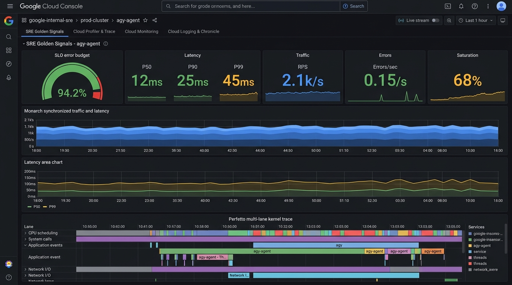
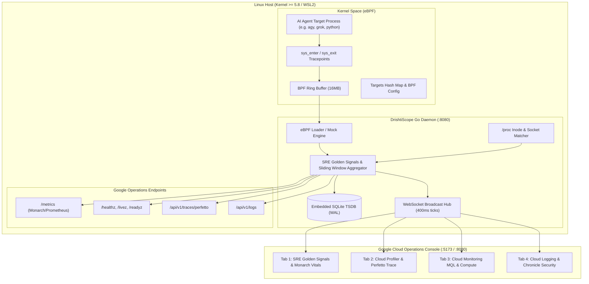

# DrishtiScope (दृष्टिScope)

> **Sanskrit: दृष्टि (Drishti — Insight, Clear Vision, Perception) + English: Scope (Observatory Instrument)**  
> **Google Cloud Operations & SRE Caliber Linux Kernel & Autonomous AI Agent Observability Platform**  
> *Powered by eBPF, Embedded SQLite TSDB, Google Monarch / Prometheus Metrics, Perfetto Trace Exporter, and Cloud Logging.*



---

## 🚀 Live Status (Running Now)

DrishtiScope is running locally in WSL2 Ubuntu in the background:
- **Google Cloud Console UI**: [http://localhost:5173](http://localhost:5173) (Vite Dev with HMR) or [http://localhost:8080](http://localhost:8080) (Production Single-Binary)
- **Monarch / Prometheus Metrics**: [http://localhost:8080/metrics](http://localhost:8080/metrics) (OpenMetrics standard format)
- **Google Borg / Kubernetes Probes**: [http://localhost:8080/healthz](http://localhost:8080/healthz), [http://localhost:8080/livez](http://localhost:8080/livez), [http://localhost:8080/readyz](http://localhost:8080/readyz)
- **Perfetto Trace Event Exporter**: [http://localhost:8080/api/v1/traces/perfetto](http://localhost:8080/api/v1/traces/perfetto) (compatible with [ui.perfetto.dev](https://ui.perfetto.dev))
- **Google Cloud Logging Exporter**: [http://localhost:8080/api/v1/logs](http://localhost:8080/api/v1/logs) (structured `LogEntry` array with severity)
- **Embedded Database**: Zero-dependency SQLite TSDB with passive WAL checkpointing at `drishtiscope.db`

---

## 🏛️ System Architecture



---

## 🌟 Why DrishtiScope? (Unique Selling Proposition)

Traditional monitoring tools (Prometheus Node Exporter, Datadog, Falco) were designed for static servers or microservices. **Autonomous AI Agents (such as `agy`, `grok`, `claude-code`, `ollama`) operate completely differently**:
1. **Dynamic Tool Execution**: AI agents rapidly spawn child processes (`bash`, `git`, `docker`, `python`) via `execve`/`vfork` bursts.
2. **Context Streaming Sockets**: AI agents maintain long-lived token streaming TCP connections to model gateways with tight latency requirements.
3. **High-Frequency Event Loops**: AI processes run epoll and futex wait cycles with sub-millisecond dispatch.
4. **Workspace File I/O Spikes**: Transcripts, scratchpads, and context caches generate massive read/write activity.

**DrishtiScope bridges the gap** between low-level Linux kernel internals and high-level autonomous agent behavior with **zero code modification** to the target.

### 📊 Architectural Benchmark: DrishtiScope vs. The Industry

| Capability | **DrishtiScope (दृष्टिScope)** | Datadog Agent | Sysdig / Falco | BCC / bpftrace | Prometheus Node Exporter |
|---|---|---|---|---|---|
| **Primary Focus** | **Autonomous AI Agents & Target Trees** | Host / Kubernetes infra | Security rule enforcement | Manual kernel debugging | Node-wide system counters |
| **Observation Mechanism** | **CO-RE eBPF + /proc Inode Matching** | eBPF + userspace probes | eBPF / kernel module | On-the-fly Clang compile | /proc & /sys scraping only |
| **Zero-Root Mock Mode** | **✓ Built-in (Full Synthetic Engine)** | ✗ Requires root daemon | ✗ Requires root | ✗ Requires root | ✗ Incomplete without root |
| **Embedded TSDB** | **✓ Zero-dependency SQLite TSDB (WAL)** | ✗ Requires SaaS Cloud | ✗ Requires external SIEM | ✗ No persistence | ✗ Needs Prometheus Server |
| **Update Latency** | **Sub-400ms Real-Time WebSocket** | 10s – 60s batch push | gRPC event stream | Terminal stdout | 15s – 30s scrape interval |
| **Google SRE Integration** | **✓ Monarch `/metrics`, Perfetto, Cloud Logging** | ✗ Proprietary format | ✗ gRPC / Syslog only | ✗ Raw stdout | ✗ Prometheus metrics only |
| **Self-Contained UI** | **✓ Single 18MB Binary (Embedded SPA)** | ✗ SaaS Subscription | ✗ Needs FalcoSidekick | ✗ No UI | ✗ Needs Grafana instance |
| **Multi-Tier Persona Views**| **✓ 4 Progressive Google Cloud Tabs** | ✗ One-size-fits-all | ✗ Security alert table | ✗ Raw CLI traces | ✗ Raw metric charts |

---

## 🎛️ Google Cloud Operations Console: The 4 Dedicated Tabs

### 1. 🔰 Tab 1: SRE Golden Signals & Monarch Vitals
- **Google SRE Golden Signals**:
  - **Latency**: Kernel syscall execution quantiles (P50, P90, P99) in microseconds.
  - **Traffic**: Syscall throughput (RPS) and network transmit/receive byte rates.
  - **Errors**: Non-zero / negative return codes per second and error ratio.
  - **Saturation**: CPU utilization %, scheduler runqueue latency, and open file descriptors vs. system limit.
- **SLO Availability & Error Budget Burn Rate Gauge**: 99.9% target with real-time error budget consumption meter and burn rate indicator (<1.0x target).
- **Monarch Synchronized Waveform**: Dual-axis synchronized time series correlating Traffic RPS against P99 Latency.
- **Target Process Identity Spotlight**: Procfs metadata, PPID tree, command-line arguments, context switches, and RSS/VMS memory footprint.

### 2. ⚡ Tab 2: Cloud Profiler & Perfetto Kernel Trace
- **Google Cloud Profiler CPU Stack Breakdown**: Low-overhead execution tree breakdown (`runtime.epollwait`, `runtime.futex`, `tokio::park`, `syscall.Syscall6`, `token_stream`, `vfs_read`).
- **Perfetto Multi-Lane Kernel Trace Timeline**: Interactive timeline lanes:
  - Lane 1: Thread scheduling (`main`, `worker/io`, `worker/eval`)
  - Lane 2: Syscalls (`futex`, `epoll_wait`, `read`, `write`, `connect`)
  - Lane 3: File I/O (`/var/lib/agent/ledger.db`, `/proc/self/status`)
  - Lane 4: Network Sockets (`10.0.0.10:443`, `1.1.1.1:53`)
- **Direct Exporters**: 1-click download of Perfetto Trace JSON and link to [ui.perfetto.dev](https://ui.perfetto.dev).
- **Top System Calls Distribution**: Bar chart of the top 15 most frequent kernel syscalls.
- **Live Process Table**: Click to inspect or re-target any active Linux process.

### 3. 🔬 Tab 3: Cloud Monitoring MQL & Deep Systems Metrics
- **Google Cloud Monitoring MQL Query Console**: Interactive Monitoring Query Language bar with presets for CPU, Memory, Syscalls, and Storage I/O.
- **Syscall Category Donut Chart**: Proportional breakdown across Sync (`futex`), File I/O, Network Sockets, Memory (`mmap`), and Process scheduling.
- **Memory Subsystem Allocation Pie Chart**: Active RSS vs. Page Cache vs. Shared Libraries vs. Virtual VMS.
- **Composed Storage Throughput & IOPS Chart**: Read KB/s and Write KB/s stacked bars with an IOPS trendline.
- **TCP Socket State Spectrum**: Distribution across `ESTABLISHED`, `TIME_WAIT`, `CLOSE_WAIT`, and `LISTEN`.

### 4. 🌐 Tab 4: Cloud Logging & Chronicle Security Command Center
- **Google Cloud Logging Log Explorer**: Query bar filtering by log name and severity (`INFO`, `WARNING`, `ERROR`).
- **JSON LogEntry Inspector**: Expandable log records featuring `insertId`, `timestamp`, `severity`, `resource.labels`, and structured `jsonPayload`.
- **Chronicle Security Sandbox Audit**: Tracking `EACCES` violations, refused outbound connections, and sensitive path access attempts (`/etc/shadow`, `/proc/kallsyms`).
- **6-Axis AI Agent Workload Radar Chart**: Multi-dimensional footprint comparing `agy` against baseline Linux daemons (Compute, Memory, Network, Disk, Syscall, Security).
- **SQLite TSDB Raw Telemetry Explorer**: Real-time inspection of time-series records persisted in `drishtiscope.db`.

---

## 🎨 Google Cloud Console Features & Controls

- **Omnibox Search**: Press `/` or `Ctrl+K` to search resources or filter processes.
- **Quick Process Selector**: Dropdown to switch targets between `agy`, `payments-agent`, `node`, `dockerd`, `kubelet`, etc.
- **Live Stream Controls**: Pause / Resume live telemetry streaming to freeze and inspect anomalies.
- **Time Range Selector**: Toggle between `1m`, `5m`, `15m`, `1h`, and `Live`.
- **Dual Theme Switch**: Toggle between **Nocturnal Control Room (Dark)** and **Clinical Operations (Light)**.

---

## 🛠️ CLI Flags & Environment Variables

| Flag / Env Var | Default | Description |
|---|---|---|
| `-addr` / `HTTP_ADDR` | `:8080` | HTTP and WebSocket listen address |
| `-comm` / `TARGET_COMM` | `agy` | Target process comm name filter |
| `-pid` / `TARGET_PID` | `0` | Target process PID (0 = match by comm) |
| `-mode` / `MODE` | `auto` | Execution mode: `auto` (tries eBPF, falls back to mock), `ebpf`, or `mock` |
| `-db` / `DB_PATH` | `drishtiscope.db` | Path to SQLite TSDB time-series database |
| `-static` / `STATIC_DIR` | `./frontend/dist` | Directory containing built React static assets |
| `-tick` / `SNAPSHOT_MS` | `400` | Snapshot aggregation interval in milliseconds |

---

## 💻 Build & Run Instructions

```bash
# 1. Run in DEMO mode (Go Mock backend + Vite UI without root)
make demo

# 2. Run with real eBPF (requires root / CAP_BPF on Linux 5.8+)
sudo ./drishtiscope --mode=ebpf --comm=agy --db=drishtiscope.db

# 3. Build single-binary production distribution
make build

# 4. Scrape Prometheus metrics
curl -s http://localhost:8080/metrics

# 5. Export Perfetto trace for ui.perfetto.dev
curl -s http://localhost:8080/api/v1/traces/perfetto -o trace.json

# 6. Fetch Google Cloud Logging records
curl -s http://localhost:8080/api/v1/logs
```

---

## 📜 License

Dual-licensed under MIT and GPL-2.0 (required for Linux eBPF kernel helper compatibility).
