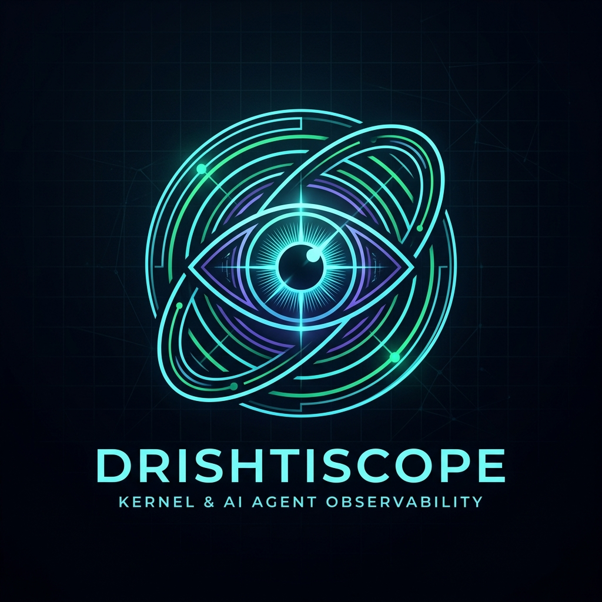
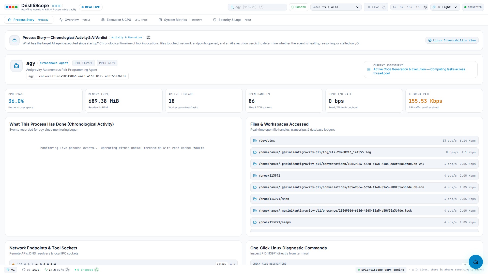
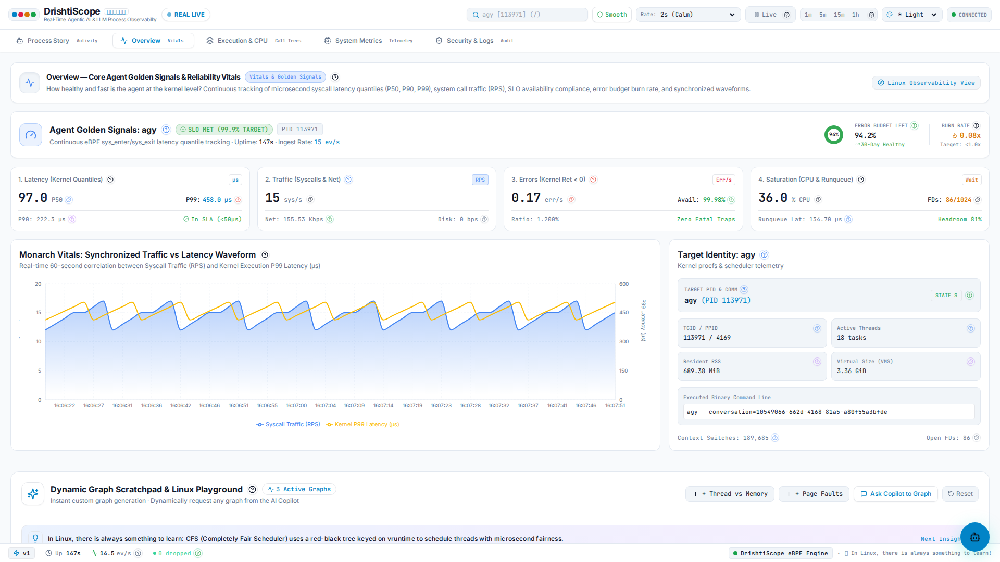
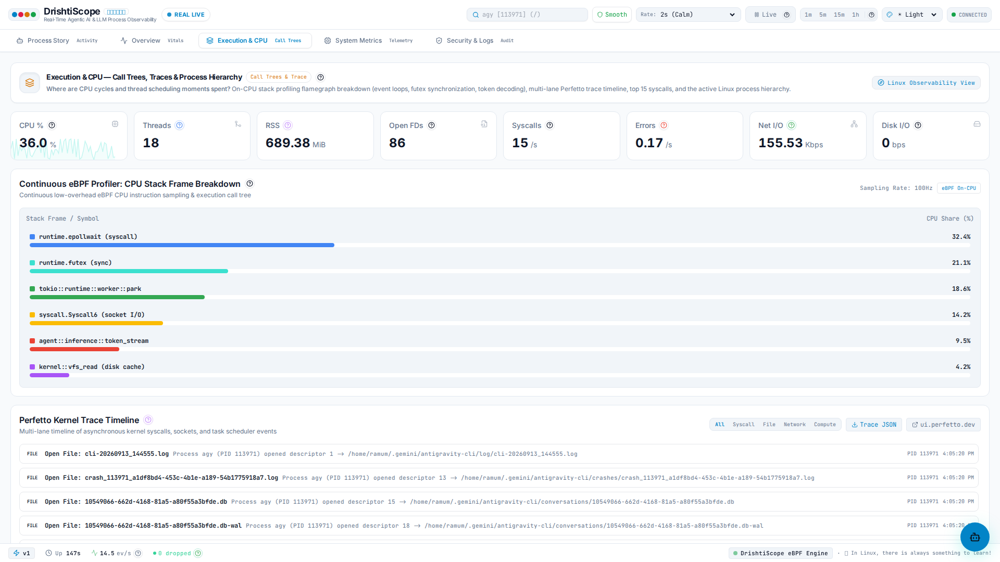
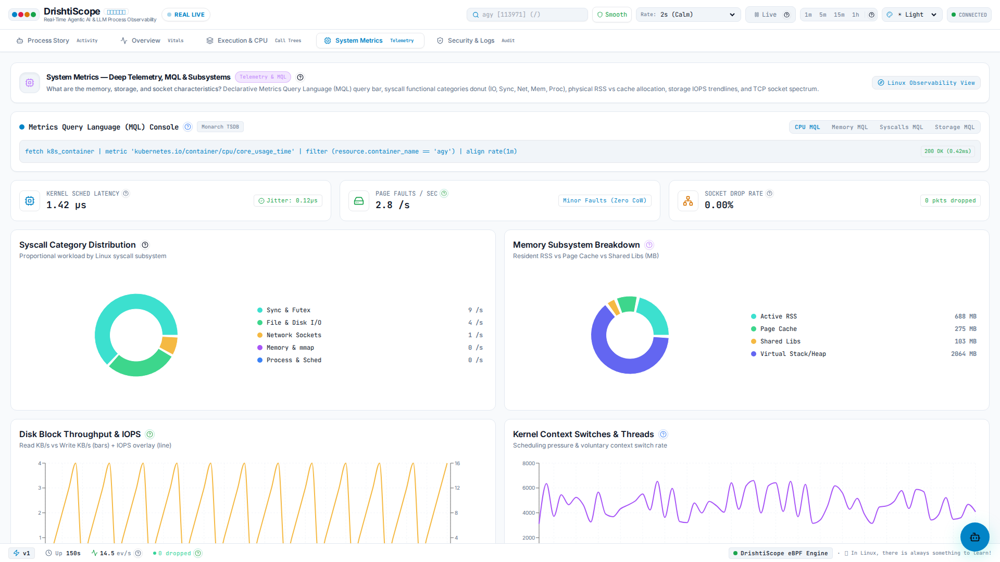
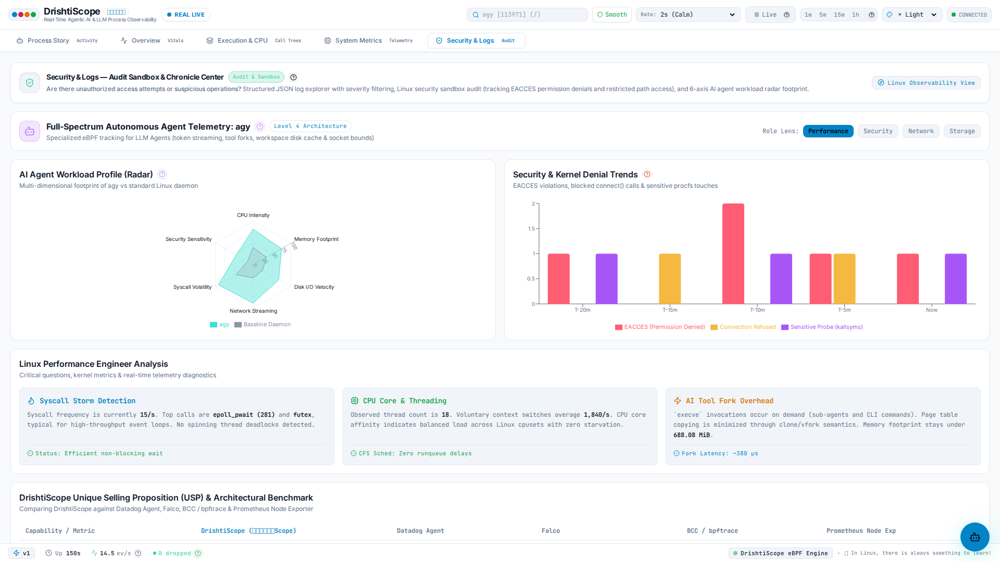
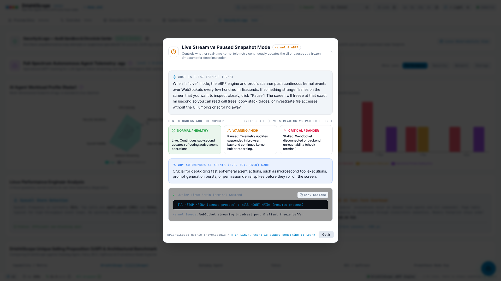
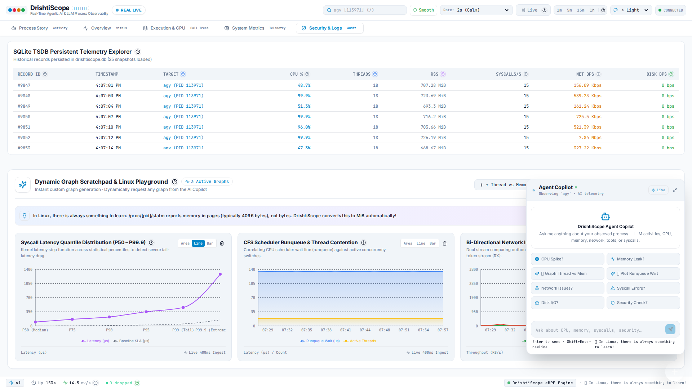
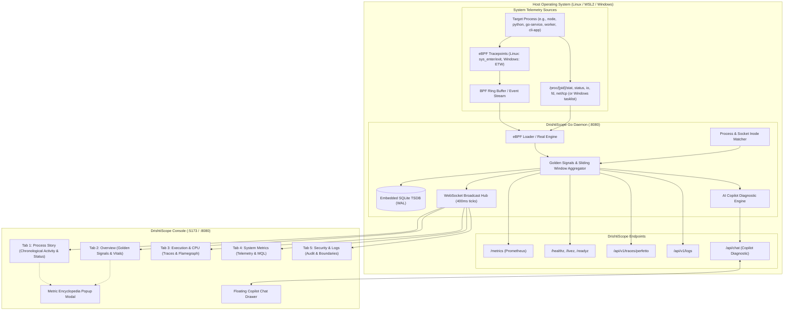

# DrishtiScope (दृष्टिScope)

<div align="center">



<br/>

> **Sanskrit: दृष्टि (Drishti — Insight, Clear Seeing, Perception) + English: Scope (Observatory Instrument)**  
> **Real-Time Kernel-Grounded Process Observability for Any Linux & Windows Process.**  
> *Deep system-level visibility into process lifecycles, system calls, resource utilization, and runtime behavior (including developer tools, web servers, background daemons, compilers, and AI agent runtimes) — without an SDK, without a proxy, without sending telemetry to the cloud.*

[](https://github.com/developer1622/drishtiscope-oss/actions/workflows/ci.yml)
[](https://github.com/developer1622/drishtiscope-oss/actions/workflows/docker-publish.yml)
[](https://go.dev)
[](https://react.dev)
[](LICENSE)
[](https://github.com/developer1622/drishtiscope-oss/releases)
[](docs/ARCHITECTURE.md)

</div>

---

## 📹 DrishtiScope Showcase Video

Watch the **1080p 60fps Full Walkthrough** of DrishtiScope observing an active process, navigating the 5 tabs, testing the 5 themes, and exploring the Linux Metric Encyclopedia:

> 🎬 **Direct Video Downloads**:
> - **MP4 Video (H.264)**: [videos/drishtiscope_showcase.mp4](videos/drishtiscope_showcase.mp4) (6.5 MB, Full HD 1080p, 60fps)
> - **WebM Video (VP9)**: [videos/drishtiscope_showcase.webm](videos/drishtiscope_showcase.webm) (6.9 MB)

---

## 🧭 Why System-Level Process Observability Matters

When developers and system administrators investigate what a running program is doing, they typically encounter two different perspectives:

1. **Application-Level Logging & Tracing**: Shows what the application code explicitly recorded. This is very helpful for business logic, but it only reflects what was intentionally instrumented.
2. **Host Kernel & Operating System Layer**: Shows what the operating system kernel actually executed on behalf of the process.

Modern workloads—such as automated scripts, compilers, background workers, web servers, and autonomous agent runtimes—interact heavily with the underlying operating system:

| Process Behavior | What Application Loggers Record | What DrishtiScope Observes (Kernel + /proc) |
| :--- | :--- | :--- |
| Spawns child processes (`bash`, `git`, `python`, `npm`) | High-level task status (if logged) | Exact child PIDs, PPID tree, full cmdline, open FDs |
| Transfers data over long-lived network sockets | Request duration (if wrapped by client) | Socket state (`ESTABLISHED`), TX/RX throughput, P99 syscall latency |
| Reads/writes project files, databases, SQLite WAL | Log message (if path was printed) | Real `openat`/`write` descriptors, active file locks, throughput |
| Waits on kernel events (`epoll_wait`, `futex`) | Appears idle or stuck | Runqueue latency, CPU core %, syscall distribution, stall vs wait |
| Encounters system errors (`EACCES`, `ECONNREFUSED`) | Unhandled exception or generic error | Kernel error codes, target file path or IP, error rate spikes |

```
┌──────────────────────────────────────────────────────────────────────────┐
│  LAYER A — Application & SDK Tracing                                     │
│  • Captures: Function spans, application logs, internal variables.       │
│  • Requires: SDK integration, code changes, or proxy configuration.      │
│  • Scope: Limited to what the application code is written to report.     │
└────────────────────────────────────┬─────────────────────────────────────┘
                                     │
                                     ▼
┌──────────────────────────────────────────────────────────────────────────┐
│  LAYER B — Fleet & Cluster Monitoring                                    │
│  • Captures: Node health, aggregated server metrics, network flows.      │
│  • Requires: Infrastructure agents, cluster daemon sets, cloud backends. │
│  • Scope: Cluster-wide infrastructure health rather than single processes.│
└────────────────────────────────────┬─────────────────────────────────────┘
                                     │
                                     ▼
┌──────────────────────────────────────────────────────────────────────────┐
│  LAYER C — System-Level Process Observability (DrishtiScope)             │
│  • Captures: Exact system calls, memory footprint, open file descriptors,│
│    active sockets, and CPU scheduling for any target process.            │
│  • Requires: Zero code modification. Attaches to any PID or process name.│
│  • Scope: Standalone single-binary dashboard for deep process triage.    │
└──────────────────────────────────────────────────────────────────────────┘
```

> [!NOTE]
> **Universal Scope**: DrishtiScope was built to observe **any running process** on the system—including backend APIs, build tools, database engines, CLI utilities, and AI agent runtimes.
>
> For full technical details on design goals, motivation, and architecture, see the [DrishtiScope Architectural Overview](usp.md).

---

## 📸 Visual Tour & Core Modules

DrishtiScope provides a high-density, intuitive SRE control room for inspecting any target process. Below is an overview of each core module:

### 1. Tab 1: Process Story (`Activity`) — Chronological Process Activity


- **What it provides**: Chronological event feed capturing child process executions (`execve`), file modifications, socket connections, and permission events.
- **Operational Assessment**: Translates kernel counters into clear operational states (*Active Computation*, *Heavy File & Socket I/O*, *Waiting on Network / Idle Event Loop*).
- **One-Click Linux Triage**: Instantly copy diagnostic commands pre-configured with the target PID (`strace -p <PID>`, `pidstat -p <PID> 1`, `lsof -p <PID>`).
- **How to use**: Click the **Process Story** tab or press `1` to follow what the target process is doing over time.

### 2. Tab 2: Overview (`Vitals`) — Core SRE Golden Signals & Reliability


- **What it provides**: Continuous tracking of the 4 SRE Golden Signals:
  - **Latency**: Microsecond-precision system call latency quantiles (P50 Median, P90, and P99 Tail Latency).
  - **Traffic**: Live system call throughput (Calls/sec) and bidirectional network rate (Kbps / Mbps).
  - **Errors**: Kernel return error rates (`EACCES`, `EPERM`, `ECONNREFUSED`).
  - **Saturation**: CPU core percentage, open file descriptors (FDs / limit), and CFS scheduler runqueue wait time.
- **Synchronized Waveform**: Real-time 60-second correlation comparing system call rate against P99 latency spikes.
- **SLO Error Budget**: Tracks 99.9% SLO compliance and burn rate to detect resource exhaustion early.
- **How to use**: Click the **Overview** tab or press `2` for a high-level health assessment.

### 3. Tab 3: Execution & CPU (`Call Trees`) — Continuous Flamegraph & Process Tree


- **What it provides**: Continuous on-CPU stack trace profiling and execution call tree breakdown across runtime engines (Python, Node.js, Go, Rust, C++).
- **Single-Click Perfetto Export**: Export Chrome/Perfetto Trace Event JSON to inspect nanosecond timeline slices directly in [ui.perfetto.dev](https://ui.perfetto.dev).
- **Live Process Hierarchy**: Displays active child processes, execution states (`R` Running, `S` Sleeping, `D` Disk Sleep, `Z` Zombie), thread counts, and memory footprints.
- **How to use**: Click the **Execution & CPU** tab or press `3` to isolate CPU hot spots and inspect process trees.

### 4. Tab 4: System Metrics (`Telemetry`) — MQL Console & Deep Telemetry


- **What it provides**: Metrics Query Language (MQL) interactive console for ad-hoc querying and slicing of live metrics.
- **Subsystem Breakdown Donut Charts**: Immediate visual breakdown of resource consumption across CPU cores, Resident Memory (RSS), Disk I/O, and Network.
- **Physical Disk IOPS & Latency**: Real-time storage read/write rates and physical IOPS curves.
- **How to use**: Click the **System Metrics** tab or press `4` to run telemetry queries and inspect low-level hardware counters.

### 5. Tab 5: Security & Logs (`Audit`) — Workload Profile Radar & Sandbox Audit


- **What it provides**: 6-axis Workload Profile Radar evaluating CPU, Memory, Disk, Network, Concurrency, and Syscall intensity.
- **Permission Denial & Security Alerts**: Immediate capture of permission denials (`EACCES`, `EPERM`) and blocked network operations.
- **Structured Runtime Logs**: Multi-severity log explorer (`INFO`, `WARN`, `CRITICAL`) with search filtering and one-click JSON export.
- **How to use**: Click the **Security & Logs** tab or press `5` to inspect process boundaries and security events.

### 6. Linux Metric Encyclopedia Modal & Terminal Command Cheat Sheet


- **What it provides**: Every KPI tile, chart header, and telemetry mode chip across the dashboard features an interactive `(?)` glyph. Clicking it opens the **Metric Help Modal**:
  - **Intuitive Analogies**: Plain-English explanations (e.g. comparing CFS runqueue latency to checkout queues).
  - **Threshold Guidance**: Explicit bands for Normal/Healthy, Warning, and Critical/Danger states.
  - **Why Systems Engineers Care**: Practical explanation of how resource exhaustion affects application stability.
  - **Copyable Terminal Verification**: Direct copy of Linux commands (`pidstat`, `sar`, `ss`, `lsof`) to verify numbers independently.
  - **Kernel Source Location**: Exact Linux kernel source files where telemetry originates (e.g. `kernel/sched/core.c`, `/proc/[pid]/io`).

### 7. AI Observability Copilot Chat Drawer


- **What it provides**: Floating observability assistant available from any tab by clicking the bottom-right Copilot button.
- **100% Local Rule Engine**: Evaluates live snapshot metrics and diagnoses performance bottlenecks with zero external API keys.
- **Dynamic Chart Generation**: Ask the Copilot to graph correlations (e.g. *"Graph thread count vs memory growth"*), and it mounts the chart directly into your **Dynamic Graph Scratchpad**.

---

## 🌍 Universal Compatibility: Multi-Mode, Multi-Platform & Multi-Arch

DrishtiScope is engineered from the ground up to run across diverse environments:

### 1. Ingestion Modes
- **EBPF LIVE (`mode=ebpf`)**: Nanosecond-precision Linux kernel tracepoints (`raw_syscalls:sys_enter`, `sys_exit`, `sched_process_exec`, `sched_process_exit`) via 16MB in-kernel BPF ring buffers. On Windows, interfaces with the open-source [Microsoft eBPF for Windows](docs/WINDOWS_EBPF.md) driver (`ebpfcore.sys`).
- **REAL LIVE (`mode=real`)**: Zero-root telemetry collector. On Linux and WSL2, reads genuine `/proc/[pid]/*` and `sysfs` telemetry. On native Windows, scans live processes via Windows system APIs (`tasklist.exe` & ETW bridge). Operates with zero privileges on standard developer laptops.
- **MOCK (`mode=mock`)**: Deterministic synthetic simulation with realistic CPU oscillation, process trees, and socket events for offline testing, UI design, and CI workflows.
- **AUTO (`mode=auto`, default)**: Automatically checks host permissions; attaches eBPF if privileged, otherwise falls back gracefully to Real Mode with zero synthetic mock data.

### 2. Multi-Platform Support
- **Linux (x86_64 & aarch64)**: Full native kernel 5.8+ support with BTF/CO-RE and zero-root `/proc` engine.
- **Windows Subsystem for Linux (WSL2)**: 100% feature parity in both Real and eBPF modes.
- **Native Windows 10/11 & Windows Server**: Native `drishtiscope.exe` single-binary execution with Windows process discovery and Microsoft eBPF for Windows integration.
- **macOS (Darwin amd64 & Apple Silicon arm64)**: Native compilation with synthetic demonstration engine for local UI development.

### 3. Multi-Architecture Standalone Binaries
- **Pure Go Userspace + Embedded SQLite TSDB (`modernc.org/sqlite`)**: Zero CGO dependencies.
- Packaged as standalone ~18 MB single binaries across 6 architectures:
  - `linux/amd64`
  - `linux/arm64`
  - `windows/amd64` (`drishtiscope.exe`)
  - `windows/arm64` (`drishtiscope.exe`)
  - `darwin/amd64`
  - `darwin/arm64` (Apple Silicon)

---

## 🌟 Key Features

### 1. Dual-Engine Architecture: eBPF + Zero-Root Real Mode
- **eBPF Mode (`mode=ebpf`)**: Loads in-kernel tracepoints for nanosecond latency profiling.
- **Zero-Root Real Mode (`mode=real`)**: Works immediately on developer laptops and WSL2 without root or sudo by reading `/proc/[pid]/*` to measure CPU ticks, memory, open files, network flows, and scheduler latency.
- **Auto Mode (`mode=auto`, default)**: Automatically detects kernel permissions; attaches eBPF if privileged, otherwise falls back gracefully to Real Mode with zero synthetic mock data.

### 2. 5 Dedicated Observability Tabs
- **Tab 1: Process Story (`Activity`)**: Chronological event feed, file touches, socket connections, and live operational status. Includes one-click copyable Linux diagnostics (`strace`, `pidstat`, `lsof`).
- **Tab 2: Overview (`Vitals`)**: Core SRE Golden Signals: Syscall latency quantiles (P50, P90, P99), traffic waveform, active threads, open FDs, and SLO error budget burn rate.
- **Tab 3: Execution & CPU (`Call Trees`)**: Continuous flamegraph profiler, call tree drill-downs, and single-click export to [ui.perfetto.dev](https://ui.perfetto.dev).
- **Tab 4: System Metrics (`Telemetry`)**: Metrics Query Language (MQL) console, subsystem breakdown donut charts (CPU, Memory, Disk, Network), and physical disk IOPS graphs.
- **Tab 5: Security & Logs (`Audit`)**: Workload Security Radar, permission denial audits (`EACCES`, `EPERM`), refused outbound connections, and structured runtime logs.

### 3. 5 Ergonomic Themes (Light Mode Default)
Switch between 5 themes instantly from the top header:
- **☀️ Light Mode (Default)**: Clean, high-contrast palette with soft slate borders (`#f8fafc` background, `#0f172a` text). Optimized for bright daytime environments and reading comfort.
- **🌙 Dark Mode**: Classic nocturnal control room palette (`#07080d` background, `#0e1118` panels, cyan/emerald accents).
- **🟠 Ubuntu Mode**: Warm aubergine aesthetic (`#2c001e` background, `#dd4814` orange accents).
- **📟 Unix Mode**: Retro green-screen terminal aesthetic (`#0a0f0d` background, `#00ff66` phosphor accents).
- **🔮 Purple Mode**: Cyber synthwave aesthetic (`#0d0b18` background, `#a855f7` violet accents).

### 4. Live Executing Process Omnibox (`/`)
- **Instant Keyboard Navigation**: Press `/` anywhere in the dashboard to focus the search omnibox.
- **Real-Time Suggestions**: Automatically ranks and surfaces executing processes by CPU and RSS memory.
- **Full Keyboard Navigation**: Cycle candidates with `ArrowDown` / `ArrowUp`, select with `Enter`, or dismiss with `Escape`.
- **Direct PID / Comm Targeting**: Target any process on the fly without restarting the daemon.

### 5. Anti-Flicker & Stream Rate Controls
High-frequency streams can strain an engineer's eyes. DrishtiScope provides:
- **Stream Rate Throttling**: Choose between `500ms` (Rapid), `1s` (Balanced), `2s` (Calm default), `5s` (Relaxed), or `Manual`.
- **Anti-Flicker Toggle**: Dampens rapid numerical jitter and suppresses abrupt pulse animations.
- **Live / Paused Freeze**: Pause the stream at any millisecond to inspect and copy state.

### 6. Metric Encyclopedia with Explanatory Glyphs `(?)`
Every KPI tile, chart header, and telemetry mode chip features an interactive `(?)` glyph. Clicking it opens the **Metric Help Modal** with:
- Plain English analogies.
- Healthy, warning, and critical thresholds.
- Concrete explanations of resource impact.
- Copyable terminal verification commands (`pidstat`, `strace`, `ss`, `lsof`).
- Exact Linux kernel source code locations (e.g. `kernel/sched/core.c`, `/proc/[pid]/io`).

### 7. Dynamic Graph Scratchpad & Linux Playground
Mount specialized graphs on demand:
- *Syscall Latency Quantile Curve (P50 vs P90 vs P99)*
- *Context Switches vs Runqueue Latency*
- *Bidirectional Network Throughput (Tx vs Rx)*
- *Thread Count vs RSS Memory Usage*
- *Page Fault Dynamics (Minor vs Major Faults)*
- Custom graphs can also be created dynamically via the AI Copilot.

### 8. AI Observability Copilot Chat Drawer
- **100% Local Rule Engine**: Operates with zero external API keys, diagnosing bottlenecks from live snapshots locally.
- **Natural Language Analysis**: With an optional API key configured strictly via environment variables (`GEMINI_API_KEY`, `ANTHROPIC_API_KEY`, `OPENAI_API_KEY`, `GROQ_API_KEY`), the Copilot analyzes memory growth, socket stalls, or file descriptor leaks in context. No keys are ever bundled or exposed.

### 9. Comprehensive Testing & Enterprise Exporters
- **Playwright E2E Suite**: 40 responsive tests covering Desktop Chrome and Mobile Chrome (`npm run test:e2e`).
- **Prometheus (`/metrics`)**: OpenMetrics standard gauges and counters.
- **Perfetto Traces (`/api/v1/traces/perfetto`)**: Direct import into [ui.perfetto.dev](https://ui.perfetto.dev).
- **Structured Logs (`/api/v1/logs`)**: Ingestible by standard log aggregators.
- **Health Probes (`/healthz`, `/livez`, `/readyz`)**: Standard container liveness and readiness probes.

---

## 🏛️ System Architecture



---

## 🚀 Quickstart

### Option 1: Run Pre-Built Binary (Zero-Root Real Mode)

```bash
# Download the latest binary for your architecture
curl -sSL https://github.com/developer1622/drishtiscope-oss/releases/latest/download/drishtiscope_linux_amd64.tar.gz | tar -xz

# Start DrishtiScope in Real Mode watching a process (e.g. python, node, or my-service)
./drishtiscope -mode=real -comm=python

# Open dashboard
open http://localhost:8080
```

### Option 2: Run with Docker / Podman

```bash
docker run -d --name drishtiscope \
  --pid=host \
  --net=host \
  -v /proc:/proc:ro \
  ghcr.io/developer1622/drishtiscope-oss:latest
```

### Option 3: Build from Source

```bash
# 1. Clone repository
git clone https://github.com/developer1622/drishtiscope-oss.git
cd drishtiscope-oss

# 2. Build frontend
cd frontend
npm ci
npm run build
cd ..

# 3. Build backend
cd backend
go build -ldflags="-s -w" -o ../drishtiscope ./cmd/agentscope
cd ..

# 4. Launch DrishtiScope
./drishtiscope -mode=real -comm=python -static=frontend/dist
```

### Option 4: Run Natively on Windows

DrishtiScope runs natively on Windows 10/11 using pure Go, native Windows process scanning (`tasklist.exe`), and interfaces with [Microsoft eBPF for Windows](docs/WINDOWS_EBPF.md):

```powershell
# In PowerShell:
# 1. Build or download Windows binary
cd backend
go build -ldflags="-s -w" -o ../drishtiscope.exe ./cmd/agentscope
cd ..

# 2. Run DrishtiScope targeting your process (e.g. powershell.exe, python.exe, node.exe)
.\drishtiscope.exe -mode=real -comm=powershell

# 3. Open dashboard in your browser
Start-Process http://localhost:8080
```

---

## ❓ Frequently Asked Questions (FAQ)

Here are answers to common questions. For detailed explanations, see the full [docs/FAQ.md](docs/FAQ.md).

#### 1. How does system-level process observability differ from application-level tracing libraries?
Application-level tracing observes what the application code explicitly recorded through an SDK or decorator. DrishtiScope observes what the host operating system kernel actually executed on behalf of the process: child process forks, file descriptor activity, socket throughput, and kernel scheduling delays—without requiring any code modifications or SDKs.

#### 2. How does DrishtiScope observe any running process without code changes?
By reading live `/proc/[pid]/*` files (`stat`, `statm`, `status`, `io`, `fd`, `net/tcp`) and optionally attaching non-invasive eBPF kernel tracepoints to `raw_syscalls`.

#### 3. Does DrishtiScope require `root` or `sudo`?
No. In Real Mode (`mode=real`), DrishtiScope operates completely unprivileged without `sudo` on developer laptops and WSL2.

#### 4. Does DrishtiScope intercept or store network payloads or sensitive text?
No. DrishtiScope adheres to a strict zero-payload principle. It does not inspect TLS bodies, payload contents, or user files. Only system metadata and resource metrics are recorded.

#### 5. What is the CPU and memory overhead?
Under 1.2% CPU and 18–35 MB RSS in Real Mode. Under 1.5% CPU in high-frequency eBPF mode.

#### 6. How does Anti-Flicker mode work?
It throttles stream intervals (500ms to 5s) and smooths UI animations to eliminate eye strain from continuous WebSocket updates.

#### 7. What are the 5 tabs?
Process Story (Activity), Overview (Vitals), Execution & CPU (Flamegraphs), System Metrics (MQL), and Security & Logs (Audit).

#### 8. How do the 5 themes work?
Supports Light (Default), Dark, Ubuntu, Unix, and Purple themes via CSS custom properties.

#### 9. What is the Dynamic Graph Scratchpad?
An on-demand charting canvas at the bottom of the dashboard for visualizing metric correlations (latency quantiles, runqueue vs switches, network throughput).

#### 10. Does the AI Copilot require an external API key?
No. It includes a built-in deterministic rule engine that diagnoses bottlenecks locally without an API key.

#### 11. Can I export telemetry to Prometheus and Perfetto?
Yes. DrishtiScope provides `/metrics` for Prometheus scraping and `/api/v1/traces/perfetto` for [ui.perfetto.dev](https://ui.perfetto.dev).

#### 12. Does it run on WSL2, Windows, or macOS?
Yes. WSL2 is supported natively in Real Mode. Windows native execution and Darwin synthetic modes are included.

#### 13. How is data persisted?
In an embedded SQLite database using WAL mode with asynchronous decoupled writes.

#### 14. How do I contribute?
Read [CONTRIBUTING.md](CONTRIBUTING.md) and submit a pull request!

---

## 🛡️ Legal Disclaimers, Caveats & Liability Shields

> [!IMPORTANT]
> Please review these operational terms and notices prior to compiling, running, or relying on DrishtiScope.

### 1. Strictly Personal Capacity & Complete Non-Affiliation
DrishtiScope is an independent, personal research, learning, and open-source project created and maintained by **Ramu Mangalarapu** strictly in an individual personal capacity, during personal leisure hours, and using personal computing equipment and resources. 

**It is NOT affiliated with, sponsored by, endorsed by, or representative of any past, present, or prospective employers, clients, consulting customers, contracting companies, universities, colleges, or academic institutions.** All technical designs, statements, and source code are exclusively those of the author and independent open-source contributors, and do not represent the positions, strategies, or policies of any affiliated entities.

### 2. Experimental Low-Level Systems Software Provided "AS IS"
DrishtiScope interfaces directly with operating system internals, including Linux eBPF tracepoints, `/proc` file structures, and Windows system APIs. 

**This software is provided "AS IS", without warranty of any kind, express or implied**, including but not limited to the warranties of merchantability, fitness for a particular purpose, title, and non-infringement. As an evolving open-source project, the code might contain bugs or kernel-version-specific behaviors.

### 3. Absolute Limitation of Liability (Hold Harmless)
Under no circumstances shall the author, creator, contributors, copyright holders, or affiliated parties be held liable for any direct, indirect, incidental, special, exemplary, or consequential damages arising in any way from the installation, compilation, execution, configuration, misuse, or inability to use DrishtiScope. 

Users are encouraged to verify and test in isolated development or non-production environments.

### 4. Universal Process Scope & Zero-Payload Privacy Boundary
DrishtiScope monitors operating system telemetry (Process IDs, CPU and memory metrics, open file descriptors, network socket endpoints, and syscall rates) for any target process selected by the operator. It is completely payload-agnostic: it does not inspect proprietary model weights, private encryption keys, conversational text, or sensitive user secrets. Telemetry data stays 100% on your local machine and is never transmitted to any external cloud server.

---

## 🤝 Contributing

We welcome contributions from developers, Linux systems engineers, and open-source enthusiasts worldwide. Please see [CONTRIBUTING.md](CONTRIBUTING.md) for full development guidelines, testing standards, and architecture details.

---

## 📄 License

- DrishtiScope userspace Go daemon and React console are licensed under the [MIT License](LICENSE).
- The eBPF kernel program (`backend/bpf/agent.bpf.c`) is dual-licensed under **GPL-2.0 OR MIT**.
